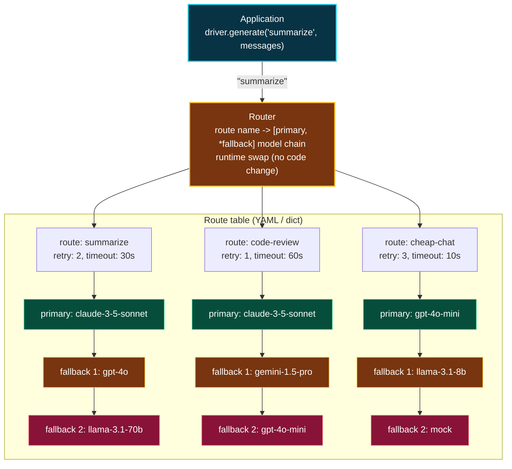
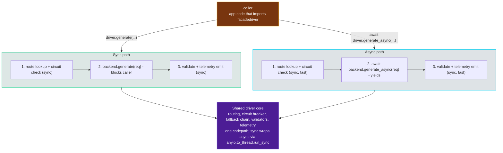
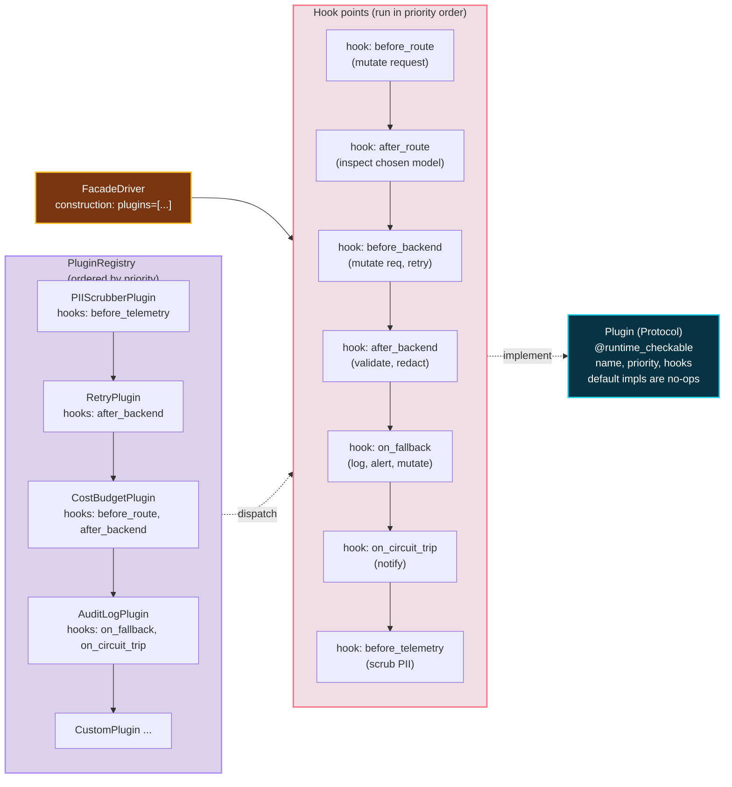
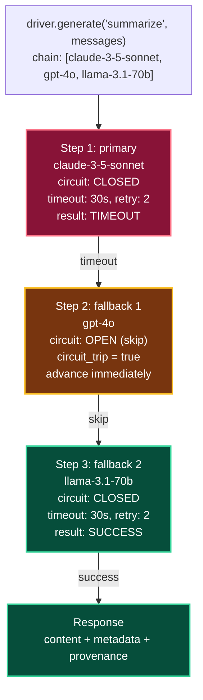
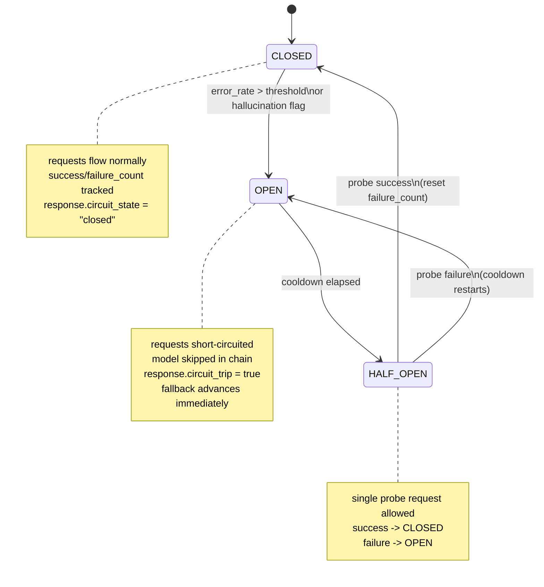
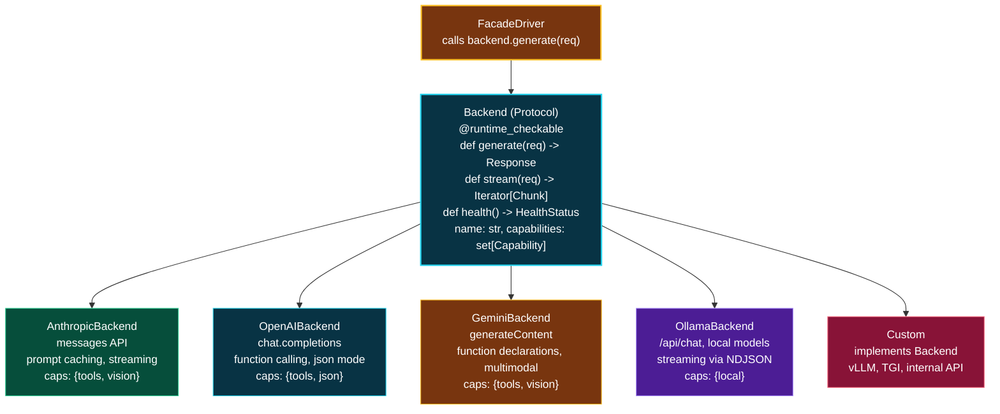
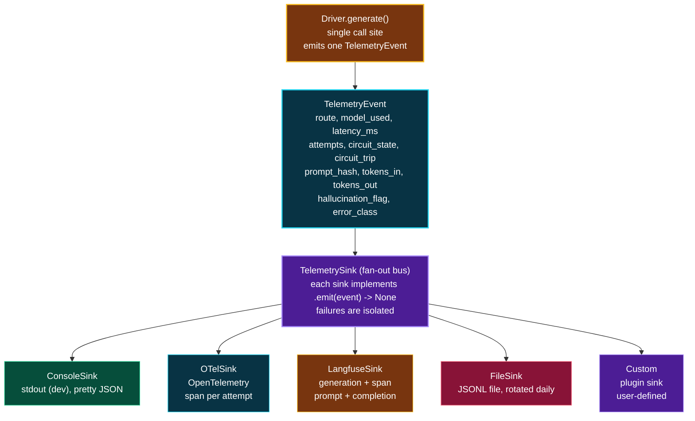

# FacadeDriver Architecture

## Design goals

1. **Model-agnostic**: application code never references a model name.
2. **Zero-downtime swap**: change the backing model at runtime.
3. **Graceful degradation**: fall back automatically on failure.
4. **Observable**: every request emits cost, latency, and fallback telemetry.
5. **Pluggable**: backends, routers, and telemetry sinks are all protocols.
6. **Thin**: the orchestration layer adds ~20us per request (see benchmarks).

## Layer diagram

```
Application
    |
    v
FacadeDriver.generate(route, messages)
    |
    +-- Router: route -> [primary, *fallback] model chain
    |
    +-- for each model in chain:
    |     |
    |     +-- CircuitBreaker.allow(model)  -- skip if open
    |     |
    |     +-- Backend.generate(model, messages)
    |     |     |
    |     |     +-- RawSDKBackend  (openai / anthropic / google-genai)
    |     |     +-- LiteLLMBackend (litellm.completion)
    |     |     +-- MockBackend    (tests, demos)
    |     |     +-- custom plugin backends
    |     |
    |     +-- on success: CircuitBreaker.record_success -> return Response
    |     +-- on failure: retry (per route config)
    |                     then CircuitBreaker.record_failure -> next model
    |
    +-- TelemetrySink.emit(event)  -- structlog / file / prometheus / custom
    |
    v
Response (content, model, cost, latency, fallback_chain, request_id)
```



_Routes, not models: a route is a stable name that maps to an ordered model chain; the call site never references a provider._

## Module layout

```
src/facadedriver/
  __init__.py        - public API exports
  types.py           - Response, Message, HealthStatus, error classes
  config.py          - typed Config, loaded from YAML or dict
  driver.py          - FacadeDriver class (sync + async)
  routing.py         - Router with runtime swap
  resilience.py      - CircuitBreaker (per-model state machine)
  telemetry.py       - TelemetrySink protocol, StructlogSink, FileSink
  backends/
    __init__.py      - Backend protocol, MockBackend, RawSDKBackend
    litellm.py       - LiteLLMBackend
  async_support.py   - AsyncBackend, AsyncMockBackend, AsyncRawSDKBackend
  cli.py             - facadedriver CLI
  server.py          - FastAPI server mode
  plugins.py         - plugin discovery and loading
  prometheus.py      - PrometheusSink + metrics server
```





_Async (left): same driver, two execution modes; sync blocks the caller, async yields control via anyio. Plugins (right): hook points at every stage; plugins register at construction and run in deterministic priority order - composable, isolated, and testable._

## Key design decisions

### Routes, not models

A route is a stable name (`"summarize"`, `"code-review"`) that maps to
a model chain. Application code uses route names. This decouples the
call site from the provider and model, enabling runtime swaps and
fallbacks without code changes.



_Fallback chain: walk the chain top-to-bottom; on failure (timeout, error, hallucination flag), advance to the next model with full context. If every model fails, the driver raises FallbackExhausted with the full attempts list attached._

### Per-model circuit breaker

The circuit breaker is keyed by model, not by route. A model can
appear in multiple routes; its health is global. This prevents one
route from hammering a failing model while another route's breaker is
still closed.



_Per-model circuit breaker: each model has its own state machine; health is global across every route that references it._

### Backend as protocol

`Backend` is a `runtime_checkable` Protocol with a single method:
`generate(model, messages, ...) -> BackendResponse`. Any object with
that method is a valid backend. This makes it trivial to add new
providers or wrap existing SDKs.



_Backend as protocol: one Backend Protocol; many providers implement it; the driver never sees provider-specific shapes. Request and Response are provider-agnostic; each backend translates to/from its native format internally._

### Telemetry never breaks the request

The driver wraps `sink.emit()` in a try/except. A broken telemetry
sink (e.g. a full disk) must never cause a user-facing failure.



_Telemetry sink fan-out: one event, many sinks; the driver emits once and each sink formats for its destination. Sink failures are caught and logged; a broken sink must not break the user's generation request._

### Lazy SDK imports

Provider SDKs (openai, anthropic, google-genai, litellm) are imported
lazily inside the backend call, not at module load time. This means
you can install FacadeDriver and use MockBackend without any provider
SDK installed. The ImportError message tells you exactly what to pip
install.

## Failure modes

| Failure             | Behavior                                           |
|---------------------|----------------------------------------------------|
| Primary model 500s  | Retry per route config, then fall back to next     |
| All models fail     | Raise `AllProvidersFailedError` with chain + errors|
| Circuit open        | Skip model, go to next in chain, set `circuit_trip`|
| Telemetry sink dies | Swallow exception, continue serving                |
| Route not found     | Raise `RouteNotFoundError`                         |

## Performance

From `benchmarks/bench_overhead.py` on a 2024 MacBook:

| Suite                          | Median   | p95      |
|--------------------------------|----------|----------|
| raw MockBackend.generate()     | 3.1us    | 5.1us    |
| FacadeDriver (null sink)       | 19.7us   | 29.6us   |
| FacadeDriver (structlog sink)  | 38.7us   | 70.7us   |
| FacadeDriver (with fallback)   | 21.5us   | 27.6us   |
| Async throughput               | 31,284 req/sec      |

For real LLM calls (100ms-10s), the ~20us overhead is negligible
(<0.01%).
