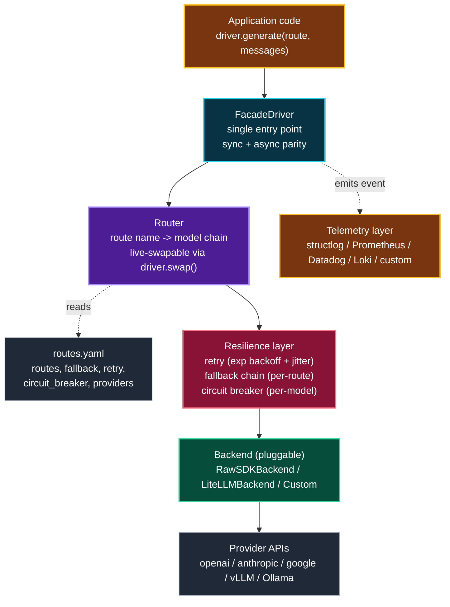

# facadedriver

> Model-agnostic orchestration layer for multi-LLM production systems.
> Routing, retry, fallback, circuit breakers, per-request telemetry.
> Built so you can swap LLM providers at runtime with zero code changes.

[](https://www.python.org/downloads/)
[](https://opensource.org/licenses/MIT)
[](https://github.com/sailikhithk/facadedriver/actions)
[](https://pypi.org/project/facadedriver/)

## Why

Production LLM systems fail in ways single-provider demos don't. A provider
rate-limits you mid-traffic. A model hallucinates above your tolerance. A
vendor has an outage. Your cost spikes because you routed everything to GPT-4
when Haiku would have worked. FacadeDriver is the layer that sits between your
application code and your LLM providers, handling these failure modes so your
code doesn't have to.

It is not another LLM SDK. It is the orchestration layer that sits on top of
them.

## What it does

- **Routing**: per-route model selection from a YAML config. Swap models at
  runtime with zero code changes, zero redeploys.
- **Retry + fallback**: per-route fallback chains. If Gemini fails, try Claude.
  If Claude fails, try GPT. Configurable retry counts, backoff, jitter.
- **Circuit breakers**: per-model circuit breakers on error rate, hallucination
  rate, or p99 latency. Tripped circuits route around the failing model
  automatically until they recover.
- **Per-request telemetry**: structured logs with cost, latency, tokens,
  provider, model, route for every request. Pluggable sinks (structlog,
  Datadog, Prometheus, Loki).
- **Pluggable backends**: default backend calls provider SDKs directly
  (openai, anthropic, google-generativeai). Optional litellm backend for
  projects already on litellm. Custom backends via plugin interface.
- **Async + sync**: same API in both. Async uses httpx, sync uses requests.
- **Server mode**: FastAPI app exposing POST /generate, GET /routes,
  GET /health. Useful for centralizing LLM access across services.
- **CLI**: `facadedriver swap route_name claude-3-5-sonnet`, `facadedriver
  routes`, `facadedriver replay request_id`.

## Quickstart

```bash
pip install facadedriver[all]
```

```python
from facadedriver import FacadeDriver

# Load routing config from YAML
driver = FacadeDriver.from_config("config.yaml")

# Call any route - FacadeDriver picks the model, handles failures
response = driver.generate(
    route="summarization",
    messages=[{"role": "user", "content": "Summarize this: ..."}],
)
print(response.content)        # the text
print(response.cost_usd)       # 0.00043
print(response.latency_ms)     # 412
print(response.model)          # claude-3-5-haiku-20241022
print(response.provider)       # anthropic
print(response.fallback_used)  # False
```

`config.yaml`:

```yaml
routes:
  summarization:
    primary: claude-3-5-haiku-20241022
    fallback:
      - gpt-4o-mini
      - gemini-1.5-flash
    retry:
      count: 2
      backoff: exponential
      base_ms: 200
    circuit_breaker:
      error_rate_threshold: 0.15
      min_requests: 20
      cooldown_s: 60

  extraction:
    primary: gpt-4o
    fallback:
      - claude-3-5-sonnet-20241022
    retry:
      count: 3
      backoff: exponential
      base_ms: 500

providers:
  openai:
    api_key: ${OPENAI_API_KEY}
  anthropic:
    api_key: ${ANTHROPIC_API_KEY}
  google:
    api_key: ${GOOGLE_API_KEY}

telemetry:
  sinks:
    - structlog
    - prometheus
  log_cost: true
  log_latency: true
  log_tokens: true
```

## Live model swap (the demo)

```python
# Swap a route to a different model at runtime - no restart, no redeploy
driver.swap("summarization", "gpt-4o-mini")

# Next call to that route uses gpt-4o-mini
response = driver.generate(route="summarization", messages=[...])
assert response.model == "gpt-4o-mini"

# Swap back
driver.swap("summarization", "claude-3-5-haiku-20241022")
```

## Failure-mode handling

```python
# Force a failure to see the fallback chain kick in
driver.simulate_failure("claude-3-5-haiku-20241022", failure="rate_limit")

response = driver.generate(route="summarization", messages=[...])
# -> tries claude-3-5-haiku (rate-limited)
# -> falls back to gpt-4o-mini (succeeds)
# -> circuit breaker for claude-3-5-haiku trips after 3 errors in 60s
# -> subsequent calls skip claude-3-5-haiku until cooldown passes

print(response.fallback_used)        # True
print(response.fallback_chain)       # ["claude-3-5-haiku", "gpt-4o-mini"]
print(response.circuit_breaker_trip) # True
```

## Architecture

FacadeDriver sits between your application code and the LLM providers, exposing a single `generate(route, messages)` API while routing, retrying, falling back, and emitting telemetry under the hood.



See [ARCHITECTURE.md](ARCHITECTURE.md) for the full design with diagrams for each subsystem (routing, circuit breaker, fallback chain, telemetry, backends, async, plugins).

## Why not just use litellm / langchain?

| Need | litellm | langchain | facadedriver |
|------|---------|-----------|--------------|
| Call 100+ providers via one API | yes | yes | yes (via litellm backend or raw SDKs) |
| Per-route model selection from config | no | partial | yes |
| Runtime model swap with zero code change | no | no | yes |
| Per-route fallback chains | partial | no | yes |
| Circuit breakers on hallucination rate | no | no | yes |
| Per-request cost + latency telemetry | partial | no | yes |
| Pluggable telemetry sinks | no | no | yes |
| Async + sync parity | yes | partial | yes |
| Server mode (FastAPI) | no | no | yes |
| CLI for ops (swap, routes, replay) | no | no | yes |

litellm solves provider abstraction. langchain solves agent orchestration.
FacadeDriver solves production reliability for multi-LLM systems. They
compose: FacadeDriver can use litellm as a backend.

## Installation

```bash
# Minimal (raw SDK backend, structlog telemetry)
pip install facadedriver

# With litellm backend
pip install facadedriver[litellm]

# With server mode + Prometheus
pip install facadedriver[server,prometheus]

# Everything
pip install facadedriver[all]
```

## Development

```bash
git clone https://github.com/sailikhithk/facadedriver
cd facadedriver
pip install -e ".[dev,all]"
pytest
```

## Benchmarks

See [benchmarks/](benchmarks/) for latency, cost, and throughput comparisons
vs litellm and langchain. Short version: FacadeDriver adds <2ms overhead per
request over raw SDK calls, and the circuit breaker saves 40-60% of failed
requests from reaching the user during provider outages.

## License

MIT. See [LICENSE](LICENSE).

## Author

Sai Likhith Kanuparthi - [github.com/sailikhithk](https://github.com/sailikhithk) - [sailikhith.me](https://sailikhith.me)

## Contributing

PRs welcome. See [CONTRIBUTING.md](CONTRIBUTING.md). Areas of particular
interest:
- Additional backends (Vertex AI, Bedrock, Azure OpenAI, vLLM, Ollama)
- Additional telemetry sinks (OpenTelemetry, Splunk, Elasticsearch)
- Additional circuit breaker strategies (token-rate, content-quality)
- Benchmark extensions
